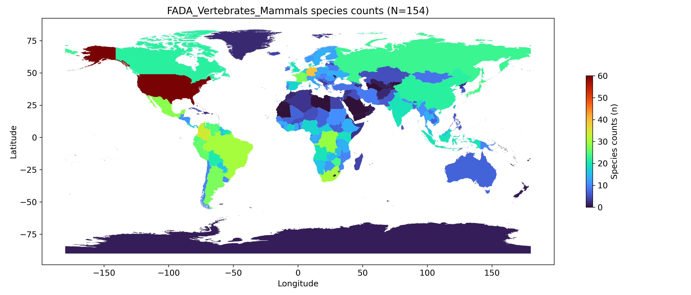

# GBIF_FWBON
@ Main authors: Marc Pienaar (m.pienaar@saeon.nrf.ac.za, marc.pienaar@gmail.com)
A small set of GBIF API processing scripts

Quick description and example
-----------------
Due to the vast number of species in many taxon groups, manual downloading is too costly. So instead, the GBIF API python client (https://www.gbif.org/tool/OlyoYyRbKCSCkMKIi4oIT/pygbif-gbif-python-client) is used here to automate the extraction and processing of information using simple examples.  
* *min* - [minimum value](https://developer.mozilla.org/en-US/docs/Web/HTML/Attributes/min) attribute.

![GBIF world shapefile] (https://drive.google.com/drive/folders/1qzxtfi3RE3WD1xSWmqT-bfT2B-l9gOr4?usp=share_link)

**1. TaxonMatch.py**

[TODO]
Used to determine species' existence from a checklist and associated taxonomic match in GBIF.

**Fgure 1**. Mammal species counts 

